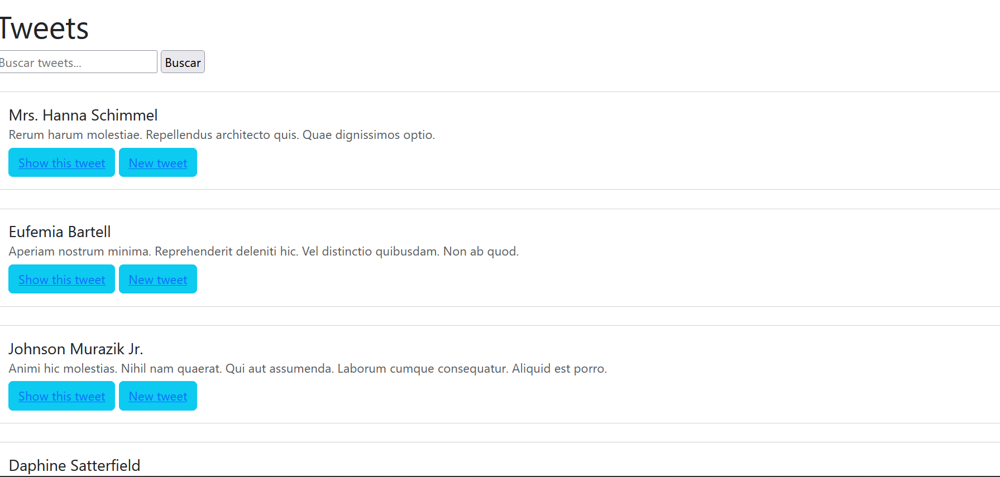

# README

TwitterCopia

TwitterCopia es una aplicación web construída en Ruby on Rails que permite a los usuarios publicar y ver tweets. Proporciona funcionalidades básicas similares a las de Twitter, como crear nuevos tweets, ver una lista de tweets y buscar tweets por contenido.

Empezando 🚀

Estas instrucciones te guiarán para obtener una copia de este proyecto en funcionamiento en tu máquina local para propósitos de desarrollo y pruebas.

Prerrequisitos 📋
    Ruby 2.7.4
    Rails 6.1.4
    PostgreSQL (como base de datos)
    Bundler gem

Instalación 🔧

    1.-Clona este repositorio en tu máquina local.
git clone https://github.com/tu_usuario/twitter-copia.git

    2.-Ve al directorio del proyecto.
cd twitter-copia

    3.-Instala las dependencias.
bundle install

    4.-Crea la base de datos y ejecuta las migraciones.
rails db:create
rails db:migrate

    5.-Inicia el servidor Rails.
rails server

    6.-Abre tu navegador web y visita http://localhost:3000 para acceder a la aplicación.

Contribuyendo 🖇️

Las contribuciones son bienvenidas. Si encuentras errores o tienes sugerencias de mejora, puedes abrir un problema en este repositorio o enviar una solicitud de extracción con tus cambios propuestos.

Ideas, mejoras planificadas y actualizaciones futuras

para el proyecto actual.
Versionado 📌

Usamos Git para el versionado. Para las versiones disponibles, ve las etiquetas en este repositorio.
Autores ✒️

    Sandra Campos Galeas- Trabajo inicial 

Mira también la lista de contribuidores que han participado en este proyecto.
Licencia 📄
licenciado bajo MIT License.

Expresiones de Gratitud 🎁

Estamos agradecidos por las contribuciones de la comunidad a este proyecto. Si encontraste cualquier valor en este proyecto o quieres contribuir, aquí está lo que puedes hacer:

    Comparte este proyecto con otros
    Invítanos un café ☕
    Inicia un nuevo problema o contribuye con un PR
    Muestra tu agradecimiento diciendo gracias en un nuevo problema.

# twitterclone
